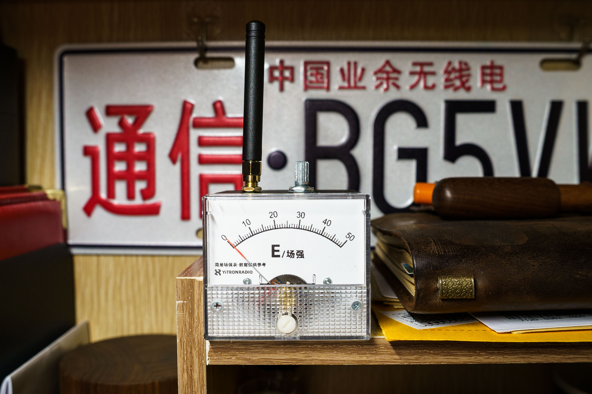

# 简易场强表（Simple Field Strength Meter）

一个用于业余无线电 **UHF/VHF 频段**的简易场强表，是参照网上资料制作的业余无线电小项目。

---

## 项目简介

Hello 大家好，我是亦川YiTRONx，呼号 **BG5VWQ**。

曾经学习业余无线电的热情我依然记得，这是我参照网上资料制作的一个小项目——**简易场强表**。它可以帮助你在发射时快速判断信号是否正常输出，是调试天线、检验对讲机发射状态的小工具。

## 功能特点

- 支持 **U 段（UHF）** 与 **V 段（VHF）** 业余无线电频段
- 指针式表头显示，直观感受信号强弱
- 当对讲机按下 PTT 发射时，指针会随着信号**跳动**
- 体积小巧，配合 3D 打印外壳，便携易用，相比大众方案更加美观
- 表盘可替换，支持自行打印粘贴

## 仓库文件说明

| 文件 / 目录 | 说明 |
| --- | --- |
| `原理图+pcb/SCH_场强表sma版_2024-12-23.json` | 原理图（嘉立创 EDA 格式） |
| `原理图+pcb/PCB_PCB_场强表_2024-12-23.json` | PCB 文件（嘉立创 EDA 格式） |
| `简易场强表外壳_STL/外壳.stl` | 3D 打印外壳模型 |
| `简易场强表外壳_STL/后盖.stl` | 3D 打印后盖模型 |
| `IMG_7433.PNG` | 替换表盘图片 |

## 所需材料与工具

> 具体元件型号与参数请以原理图为准。

- 按原理图 BOM 购买所需元件（表头、检波二极管、电容、电阻、接线端子等）
- 对讲机（用于测试）
- 焊接工具：电烙铁、焊锡、助焊剂等
- 嘉立创 EDA（打开/编辑原理图与 PCB）
- 3D 打印机或打印服务

## 制作步骤

1. **打开工程**：使用嘉立创 EDA 打开 `原理图+pcb/` 中的原理图和 PCB 文件
2. **免费打样**：在嘉立创下单 PCB 打样（满足条件可免费）
3. **购买元件**：按原理图 BOM 采购元件
4. **焊接组装**：将元件焊接至 PCB 上，完成电路板
5. **打印外壳**：使用 `简易场强表外壳_STL/` 中的 STL 文件 3D 打印外壳与后盖
6. **整机装配**：将电路板装入外壳，完成后即可测试使用

## 使用方法

将场强表天线对准对讲机天线附近，在对讲机处于业余无线电允许使用的 **U 段或 V 段**时按下 PTT，观察指针可以随信号跳动。

## 3D 打印外壳说明

- 外壳与后盖模型位于 `简易场强表外壳_STL/` 目录下
- 使用常见 FDM 打印机即可打印，材料推荐 PLA 或 PETG
- 后盖与外壳配合安装电路板，完成整机装配

## 替换表盘

我还制作了**替换表盘**，可以自行打印粘贴，让场强表更符合你的喜好。

## 视频教程

完整制作教程请看 B 站视频：

📺 [【自制简易场强表 - 哔哩哔哩】](https://b23.tv/K1VuIxb)

## 作者与致谢

- 作者：亦川YiTRONx
- 呼号：BG5VWQ

---

*注意：本项目仅供业余无线电爱好者学习交流使用，请遵守当地无线电管理法规。*
